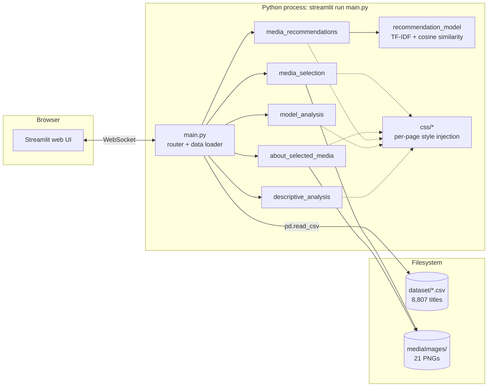
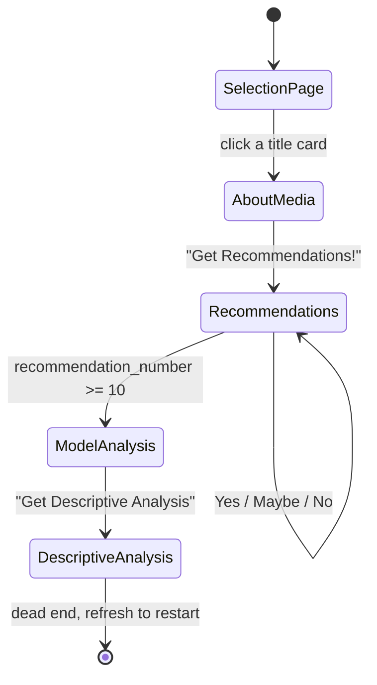
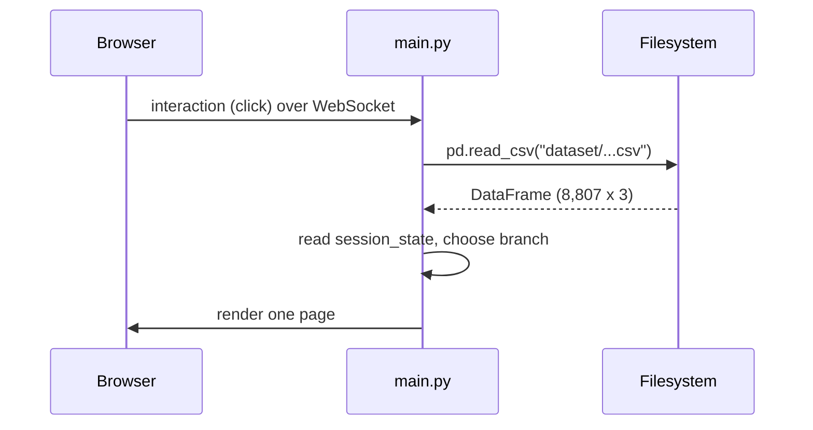
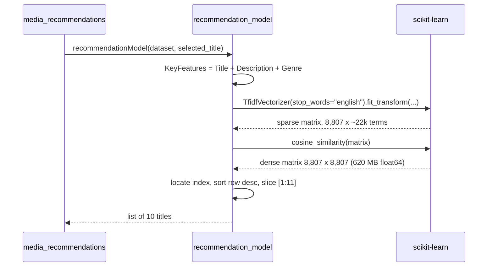
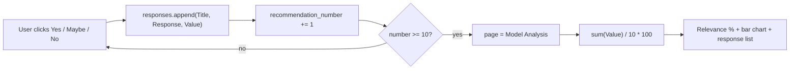
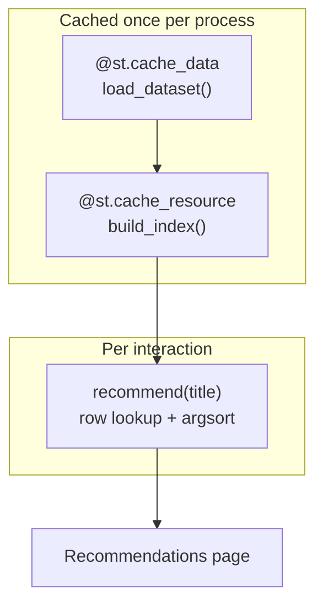

# Architecture

> Scope: the system design of the Movie & TV Show Recommendation Model — how the pieces fit
> together, how state and data move, and why the design is the way it is.
> For the algorithm itself see [MODEL.md](MODEL.md); for runtime and deployment see
> [INFRASTRUCTURE.md](INFRASTRUCTURE.md).

---

## 1. System overview

The application is a **single-process, single-tier Streamlit app**. There is no API layer, no
background worker, no database, and no persistent server-side state. Everything — data
loading, model inference, chart rendering, and HTML delivery — happens inside one Python
process that Streamlit runs on behalf of each connected browser session.



### Architectural style

| Property | Value |
| --- | --- |
| Tier count | 1 (UI, logic, and data in one process) |
| State model | Ephemeral, per-browser-session, in-memory (`st.session_state`) |
| Persistence | None. The CSV is read-only input; nothing is written back |
| Concurrency model | One Streamlit script run per user interaction, per session |
| Model serving | In-process, recomputed on demand — no model artefact, no training step |

---

## 2. Module map and responsibilities

| Module | Responsibility | Depends on |
| --- | --- | --- |
| [`main.py`](../main.py) | Loads the dataset once per script run; initialises session state; dispatches to exactly one page renderer | All five page modules, pandas, streamlit |
| [`recommendation_model.py`](../recommendation_model.py) | Pure function: given a DataFrame and a title, return the 10 most similar titles | scikit-learn |
| [`media_selection.py`](../media_selection.py) | Renders the 20-card picker; writes `selected_movie` and `selected_movie_image` into session state | `css.media_selection_css` |
| [`about_selected_media.py`](../about_selected_media.py) | Looks up and displays the selected title's genre and description | `css.about_media_css` |
| [`media_recommendations.py`](../media_recommendations.py) | Invokes the model; walks the user through the 10 results one at a time; records scored responses | `recommendation_model`, `css.media_recommendations_css` |
| [`model_analysis.py`](../model_analysis.py) | Aggregates the recorded responses into a relevance percentage, a bar chart, and a response list | `css.model_analysis_css`, pandas |
| [`descriptive_analysis.py`](../descriptive_analysis.py) | Renders catalogue-level genre statistics (treemap, pie chart) | matplotlib, seaborn, squarify, `css.descriptive_analysis_css` |
| `css/*.py` | Each exports one no-argument function that injects a `<style>` block via `st.markdown(..., unsafe_allow_html=True)` | streamlit |

### Boundaries that hold

- **`recommendation_model.py` is the only ML code.** It has no Streamlit import and no
  knowledge of pages or session state. It is the one module that is trivially unit-testable
  as-is.
- **Presentation is separated from page logic.** No page module contains a CSS string; it
  calls its style function instead.
- **Page modules do not import each other** — with one exception, noted below.

### Boundaries that leak

- [`model_analysis.py:4`](../model_analysis.py:4) imports `recommendationModel` from
  `media_recommendations`. That import is **never used**, and it creates a page-to-page
  dependency that only resolves because `media_recommendations` re-exports the symbol it
  imported from `recommendation_model`. It should be deleted.
- [`model_analysis.py:17`](../model_analysis.py:17) takes `responses` as a parameter but then
  also reads `st.session_state.responses` directly for the bar chart, so it reads the same
  data through two different channels.
- [`recommendation_model.py:10`](../recommendation_model.py:10) **mutates the DataFrame it is
  given**, adding a `KeyFeatures` column in place rather than working on a copy.

---

## 3. Routing and navigation

There is no Streamlit multipage setup (no `pages/` directory). Routing is a hand-rolled
`if/elif` chain in [`main.py`](../main.py) driven by session-state keys.

### The routing contract

| Key | Type | Set by | Read by |
| --- | --- | --- | --- |
| `selected_movie` | `str \| None` | `media_selection` | `main`, `about_selected_media`, `media_recommendations` |
| `selected_movie_image` | `str \| None` | `media_selection` | `about_selected_media` |
| `page` | `str` | `main` (default), every page on transition | `main`, every page (to gate CSS) |
| `recommendation_number` | `int` | `media_recommendations` | `media_recommendations` |
| `responses` | `list[dict]` | `media_recommendations` | `model_analysis` |

`main.py` guards the whole chain with `if st.session_state.selected_movie is None:` — so until
a title is picked, **every** request lands on the selection page regardless of what `page`
says. Once a title is picked, `page` alone decides the destination.

### Navigation graph



The graph is **strictly forward-only**. No page offers a route backwards, and
Descriptive Analysis is a terminal state with no exit. A browser refresh resets Python
session state and returns the user to the selection page.

### The rerun mechanism

Streamlit re-executes `main.py` top to bottom on every interaction. Each page's buttons
follow the same three-step pattern:

```python
if st.button("..."):
    st.session_state.page = "<next page>"
    st.rerun()
```

`st.rerun()` aborts the current script run immediately and starts a fresh one, which now
falls into a different branch of the router. This is why state mutation must happen *before*
the `st.rerun()` call — anything after it is unreachable.

---

## 4. Data flow

### Cold path — every script run



The CSV is re-read from disk on **every single rerun**. At 1.7 MB this is inexpensive
(tens of milliseconds) but it is unnecessary work that `@st.cache_data` would eliminate.

### Recommendation path



**This entire pipeline runs on every rerun of the recommendations page** — the function is
called unconditionally at the top of `renderRecommendationsPage`, and every Yes/Maybe/No
click triggers a rerun. A complete pass through 10 recommendations therefore builds the
620 MB similarity matrix **at least 11 times**. This is the single largest performance and
memory issue in the system; see
[ENGINEERING.md](ENGINEERING.md#5-known-issues-and-technical-debt) and
[MODEL.md](MODEL.md#5-computational-cost).

### Scoring path



---

## 5. Presentation architecture

Each page injects its own stylesheet through `st.markdown` with `unsafe_allow_html=True`.
Two kinds of selector are used, and they have very different stability characteristics:

| Selector kind | Example | Stability |
| --- | --- | --- |
| Author-defined classes | `.media-title`, `.accuracy`, `.response-container` | **Stable** — defined in this codebase, matched against `<div>`s this codebase emits |
| Streamlit-generated Emotion hashes | `.st-emotion-cache-1w723zb`, `.st-emotion-cache-nl76d5` | **Unstable** — content hashes generated by Streamlit's CSS-in-JS layer. They change without notice between Streamlit releases |

Roughly two-thirds of the CSS in `css/` targets Emotion hashes. Because those hashes are
derived from Streamlit's own internal styles, **any Streamlit upgrade can silently break the
layout** without raising an error — containers revert to default widths, buttons lose their
colour, the grid loses its spacing. Nothing fails loudly.

The application-level classes (`media-title`, `media-genre`, `media-description`,
`accuracy`, `response`, `response-container`) are safe and should be the pattern going
forward. Where a Streamlit internal must be targeted, the supported approach is its
`data-testid` attribute (for example `[data-testid="stAppViewContainer"]`), which Streamlit
treats as a public hook.

### HTML injection

`about_selected_media.py`, `media_recommendations.py`, and `model_analysis.py` interpolate
dataset values straight into HTML strings:

```python
st.markdown(f'<div class="media-title">{media_details["Title"]}</div>', unsafe_allow_html=True)
```

The dataset is a static, trusted, version-controlled file, so this is not an exploitable
injection today. It is still a latent hazard: any title or description containing `<`, `>`,
or `&` will render incorrectly, and the pattern becomes a real XSS vector the moment the
catalogue is sourced from anywhere user-writable. See
[ENGINEERING.md](ENGINEERING.md#6-security-considerations).

---

## 6. Design decisions and trade-offs

| Decision | Rationale | Trade-off accepted |
| --- | --- | --- |
| **Content-based filtering, not collaborative** | No user history exists, and none is collected. Content-based works from day one with zero users | Cannot capture taste patterns, popularity, or "people who liked X also liked Y". Recommendations are purely lexical |
| **TF-IDF + cosine similarity** | Interpretable, dependency-light, deterministic, needs no training run or GPU | No semantic understanding. Synonyms and paraphrases score as unrelated. See [MODEL.md](MODEL.md#7-limitations) |
| **CSV instead of a database** | 8,807 rows x 3 columns is ~1.7 MB. A database would add operational surface for no benefit | No incremental updates, no querying, no concurrent writes. The whole file is re-read per rerun |
| **Streamlit instead of a web framework** | Turns Python into a UI with no frontend build step, no JS, no routing library | Full-page reruns as the only update mechanism; styling limited to CSS injection against generated class names |
| **Hand-rolled `if/elif` routing instead of `pages/`** | Total control over the forward-only flow; the app can force users through the funnel in order | Routing logic is manual and must be kept in sync across six files; no URL-addressable pages; no browser back button support |
| **20 hard-coded seed titles with local posters** | Guarantees every entry point has artwork and a known-good dataset match | Adding a title means editing code *and* adding a PNG. The picker cannot browse the full catalogue |
| **Model recomputed per call rather than cached** | Simplest possible implementation — a pure function with no lifecycle | ~620 MB allocated and seconds of CPU burned on every interaction |
| **Relevance measured by the user, in-session** | Gives an honest human judgement of recommendation quality with no ground-truth labels | Sample size of 10, single user, no persistence, not comparable across sessions |

---

## 7. Quality attributes

| Attribute | Current state |
| --- | --- |
| **Performance** | Poor under interaction. Each click rebuilds a full 8,807² similarity matrix. See [MODEL.md](MODEL.md#5-computational-cost) |
| **Scalability** | Single process, no horizontal story. Memory scales with the *square* of catalogue size — 2x the titles is 4x the RAM |
| **Availability** | Not applicable — local desktop app. No health checks, no restart policy |
| **Observability** | None. No logging, no metrics, no error handling. Failures surface as Streamlit tracebacks in the browser |
| **Security** | Low exposure (local, read-only, no auth, no secrets, no network egress). HTML injection is latent rather than active. See [ENGINEERING.md](ENGINEERING.md#6-security-considerations) |
| **Accessibility** | Not assessed. Poster buttons carry text labels, which helps; colour contrast, chart alt text, and keyboard order are unverified |
| **Maintainability** | Mixed. Module separation is clean; the Emotion-hash CSS and the absence of tests are the two weak points |
| **Testability** | `recommendationModel` is a pure function and directly testable. Page renderers are not, as they call Streamlit APIs during render |

---

## 8. Target architecture

The changes below preserve behaviour while removing the two structural problems
(recomputation and dataset re-reads). They are ordered by impact-to-effort.



1. **Cache the dataset** — decorate a `load_dataset()` helper with `@st.cache_data`. Removes
   one disk read per interaction.
2. **Cache the similarity computation** — decorate the TF-IDF step with `@st.cache_resource`
   so it is built once per process instead of once per click. This alone removes ~10 of the
   11 matrix builds in a normal session.
3. **Split `recommendationModel`** into `build_index(dataset)` and
   `recommend(index, title, k=10)`, so the expensive part is cacheable and the cheap part is
   free. Stop mutating the caller's DataFrame.
4. **Avoid materialising the dense matrix** — computing `cosine_similarity(X[i], X)` for a
   single row needs ~70 KB instead of 620 MB. Only the selected title's row is ever used.
5. **Delete the unused `recommendationModel` import** from `model_analysis.py` to restore the
   page-module independence rule.
6. **Replace Emotion-hash selectors** with `data-testid` selectors or author-defined classes,
   so Streamlit upgrades stop being a styling risk.
7. **Add reverse navigation** — a "Start over" control that clears `selected_movie`,
   `recommendation_number`, and `responses`.

Items 1-4 are the difference between an app that feels sluggish and one that responds
instantly, and between a ~1.5 GB process and a ~150 MB one.
