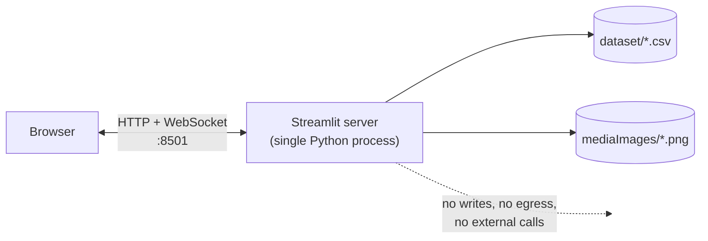

# Infrastructure and Operations

> Scope: what the application needs to run, what it consumes, how to deploy it, and how to
> operate it when something goes wrong.
> For code-level concerns see [ENGINEERING.md](ENGINEERING.md).

---

## 1. Runtime topology

There is no infrastructure in the conventional sense. The application is **one Python
process** started by `streamlit run main.py`. It serves its own HTTP and WebSocket traffic,
reads a CSV and a folder of PNGs from the local filesystem, and holds all state in memory.



| Component | Present? |
| --- | --- |
| Database | No — a static CSV |
| Cache / Redis | No |
| Message queue | No |
| Object storage | No — local filesystem |
| Authentication service | No |
| External API calls | None |
| Background jobs | None |
| Secrets / credentials | None |
| Persistent volumes | None required |

The absence of secrets and outbound network calls is worth stating explicitly: the process
needs no `.env` file, no API keys, and no internet access at runtime. `.gitignore` lists
`.env` as a precaution; no such file exists or is expected.

---

## 2. Dependencies

| Package | Constraint | Used for |
| --- | --- | --- |
| `streamlit` | `>=1.52.0` | Web server, UI widgets, session state, routing substrate |
| `pandas` | `>=2.0` | CSV loading, DataFrame lookups, response aggregation |
| `scikit-learn` | `>=1.4` | `TfidfVectorizer`, `cosine_similarity` |
| `matplotlib` | `>=3.8` | Treemap and pie chart figures |
| `seaborn` | `>=0.13` | Colour palette for the treemap |
| `squarify` | `>=0.4.3` | Treemap layout algorithm |

`numpy` arrives transitively via pandas and scikit-learn and is not declared directly.

### The Streamlit version floor is a hard constraint

`streamlit>=1.52.0` is not a preference. [`media_selection.py:47`](../media_selection.py:47)
passes `width="content"` to `st.container()`, which Streamlit's own runtime validation
rejected before 1.52.0. The selection page — the entry point to the entire application —
raises on first render against anything older. Full breakdown in
[ENGINEERING.md](ENGINEERING.md#the-streamlit-152-floor).

### Version drift risk

`requirements.txt` sets floors, not pins. Because the page styling depends on Streamlit's
internal Emotion class hashes ([issue 1](ENGINEERING.md#1-css-targets-streamlits-internal-class-names)),
a Streamlit upgrade can silently change the app's appearance while every test still passes.

**Recommendation:** freeze a lockfile for any environment where appearance matters.

```bash
pip freeze > requirements.lock.txt
```

Then install with `pip install -r requirements.lock.txt` and treat a Streamlit bump as a
change requiring visual review of all five pages.

---

## 3. Resource footprint

### Measured and derived figures

| Resource | Value | Source |
| --- | --- | --- |
| Project on disk | ~20 MB | 18 MB posters + 1.7 MB CSV + ~0.1 MB source |
| Installed dependencies | ~230 MB | scikit-learn, pandas, numpy, matplotlib dominate |
| Baseline process memory | ~150–250 MB | Python + Streamlit + imported libraries |
| **Peak memory during recommendation** | **+620 MB** | 8,807² × 8 bytes = 620,505,992 bytes, exact |
| Practical peak per session | ~800 MB – 1.5 GB | Baseline + matrix + allocator fragmentation across repeated builds |
| CPU | Bursty — near-100% of one core during each matrix build, idle otherwise | Single-threaded apart from BLAS-backed operations |
| Network | Localhost only. ~18 MB of posters on first selection-page load | |

### Sizing guidance

| Deployment | Guidance |
| --- | --- |
| Local development | 4 GB RAM comfortable; 2 GB is the practical minimum |
| Single-user demo server | 2 vCPU / 4 GB |
| Multi-user | **Do not deploy multi-user without fixing the caching issue first.** Each concurrent session independently builds its own 620 MB matrix on every click. Five simultaneous users can exhaust 8 GB |

### After the recommended caching fix

Applying `@st.cache_resource` to the index build and computing a single similarity row
instead of the full matrix (see
[ARCHITECTURE.md](ARCHITECTURE.md#8-target-architecture)) changes the picture entirely:

| | Current | Cached + single-row |
| --- | --- | --- |
| Peak memory | ~800 MB – 1.5 GB | ~200–300 MB |
| Matrix builds per session | 11+ | 0 (a shared index, built once per process) |
| Per-click latency | Seconds | Milliseconds |
| Viable concurrent users on 4 GB | ~2 | Dozens |

This is the single change that converts the app from a local demo into something deployable.

---

## 4. Configuration

There is no application configuration — no config file, no environment variables, no
feature flags. Behaviour is entirely determined by the source and the CSV.

Streamlit's own settings can be supplied via `.streamlit/config.toml` (not currently present)
or CLI flags:

| Setting | Flag | Default | When to change |
| --- | --- | --- | --- |
| Port | `--server.port 8501` | 8501 | Port conflict, or reverse-proxy convention |
| Bind address | `--server.address localhost` | localhost | **Only** change for intentional network exposure |
| Headless mode | `--server.headless true` | false | Servers and containers — stops Streamlit trying to open a browser |
| Usage telemetry | `--browser.gatherUsageStats false` | true | Privacy-sensitive environments |
| File watcher | `--server.fileWatcherType none` | auto | Production, where hot reload is unwanted |
| Max upload size | `--server.maxUploadSize` | 200 MB | Not relevant — the app accepts no uploads |

### Working-directory requirement

All filesystem paths in the code are relative to the process working directory. **The process
must be started from the project root.** Starting elsewhere produces `FileNotFoundError` on
the CSV read at [`main.py:10`](../main.py:10). This is the most common first-run failure; see
[ENGINEERING.md](ENGINEERING.md#8-working-directory-dependence) for the fix.

---

## 5. Deployment options

The project is designed for local execution. These options are ordered by effort.

### A. Local (the supported path)

```bash
streamlit run main.py
```

Suitable for development, demos, and portfolio review. Nothing else is required.

### B. Streamlit Community Cloud

The lowest-effort hosted option — connect a GitHub repository and point it at `main.py`.

**Blockers to resolve first:**

1. **Memory.** Community Cloud instances are memory-constrained. The uncached 620 MB
   allocation per click will likely trigger an out-of-memory restart.
   [Fix the caching issue first](ARCHITECTURE.md#8-target-architecture).
2. **Repository size.** 18 MB of poster PNGs plus a 1.7 MB CSV is acceptable but worth
   optimising.
3. **Image licensing.** Public deployment redistributes third-party promotional artwork.
   Resolve the question in [DATA.md](DATA.md#7-licensing-and-privacy) before publishing.

### C. Container

No `Dockerfile` exists. A minimal one:

```dockerfile
FROM python:3.12-slim
WORKDIR /app
COPY requirements.txt .
RUN pip install --no-cache-dir -r requirements.txt
COPY . .
EXPOSE 8501
HEALTHCHECK --interval=30s --timeout=5s --start-period=20s \
  CMD python -c "import urllib.request; urllib.request.urlopen('http://localhost:8501/_stcore/health')"
CMD ["streamlit", "run", "main.py", \
     "--server.port=8501", "--server.address=0.0.0.0", "--server.headless=true"]
```

Set a memory limit of at least 2 GB (`--memory=2g`) until the caching fix lands; 512 MB after.

Streamlit exposes `/_stcore/health` for liveness checks, which is what the `HEALTHCHECK` above
uses.

### D. VM or on-premises server

Run under a process supervisor (`systemd`, `supervisord`) with a reverse proxy in front.
Requirements beyond the container case:

- **WebSocket proxying is mandatory.** Streamlit's entire UI runs over a WebSocket; a proxy
  that does not upgrade the connection produces a permanently blank page. For nginx:
  `proxy_http_version 1.1; proxy_set_header Upgrade $http_upgrade; proxy_set_header Connection "upgrade";`
- TLS termination at the proxy.
- Authentication — Streamlit provides none.
- A restart policy; the app has no self-recovery.

### Deployment checklist

Regardless of target:

- [ ] `streamlit>=1.52.0` installed — verify with `streamlit version`
- [ ] All five pages visually verified against the installed Streamlit version
      ([styling is version-coupled](ENGINEERING.md#1-css-targets-streamlits-internal-class-names))
- [ ] Dataset contract checks pass ([DATA.md](DATA.md#6-catalogue-refresh-procedure))
- [ ] Process starts from the project root
- [ ] Memory limit set to at least 2 GB, or the caching fix applied
- [ ] `--server.headless=true` set for any non-desktop target
- [ ] Bind address deliberate — `localhost` unless network exposure is intended
- [ ] Image licensing cleared for any public deployment

---

## 6. Rollback

The application is **stateless with no persistent storage and no schema**, which makes
rollback unusually simple: there is no data to migrate, no cache to invalidate, and no
irreversible step.

| Change type | Rollback |
| --- | --- |
| Code change | Revert the commit and restart the process. No cleanup required |
| Dependency upgrade | Reinstall from the previous lockfile and restart. `pip install -r requirements.lock.txt` |
| Dataset replacement | Restore the previous CSV from version control and restart. Regenerate any golden-set test fixtures |
| Configuration change | Restart with the previous flags |
| Container deployment | Redeploy the previous image tag |

**The one gotcha:** after any rollback that changes the Streamlit version, re-verify the
visual appearance of all five pages. The CSS depends on Streamlit's internal class hashes, so
a version change in either direction can alter the layout without producing an error.

There are no database migrations, so no rollback scripts exist or are needed.

---

## 7. Observability

**Current state: none.** There is no logging, no metrics, no tracing, no error reporting, and
no uptime monitoring. Failures surface as Python tracebacks rendered in the user's browser.

### What exists for free

| Signal | Where |
| --- | --- |
| Streamlit server log | stdout of the `streamlit run` process — startup, connections, unhandled exceptions |
| Health endpoint | `GET /_stcore/health` returns `ok` when the server is up |
| Browser-rendered tracebacks | Visible to the user, which is useful in development and inappropriate in production |

### Minimum viable instrumentation

If this is ever deployed beyond a local demo, in priority order:

1. **Suppress tracebacks in the UI** — set `client.showErrorDetails = false` and log
   server-side instead.
2. **Structured logging** — a `logging` call at each page transition, at model invocation
   with its duration, and in an exception handler around the CSV load.
3. **Time the model call** — this is the one operation whose cost varies meaningfully, and the
   number directly validates whether the caching fix is working.
4. **Process memory metric** — given the 620 MB-per-call allocation, RSS is the leading
   indicator of trouble.
5. **Health check wired to the supervisor** — `/_stcore/health` with an automatic restart
   policy.

---

## 8. Operations runbook

### Start the application

```bash
streamlit run main.py
```

Expected: the terminal prints a local URL (default <http://localhost:8501>) and a browser tab
opens. First render of the selection page takes a few seconds while the 18 MB of posters load.

### Stop the application

`Ctrl+C` in the terminal running the process. There is no shutdown procedure — no state to
flush, no connections to drain.

### Restart cleanly

Stop, then start. Every session's state is destroyed on restart, which is the intended way to
clear a stuck session.

---

### Symptom: `FileNotFoundError: dataset/movies_and_tv_shows_dataset.csv`

**Cause:** the process was not started from the project root.

**Fix:** `cd` to the directory containing `main.py` and re-run. Verify with:

```bash
ls main.py dataset/movies_and_tv_shows_dataset.csv
```

---

### Symptom: `TypeError: container() got an unexpected keyword argument 'width'`

**Cause:** Streamlit older than 1.48.0.

**Fix:**

```bash
pip install --upgrade "streamlit>=1.52.0"
```

---

### Symptom: `StreamlitInvalidWidthError` on the selection page

**Cause:** Streamlit between 1.48.0 and 1.51.x. The `width` parameter exists but rejects the
value `"content"`.

**Fix:** same as above — upgrade to 1.52.0 or newer. Confirm with `streamlit version`.

---

### Symptom: the page loads but looks unstyled — wrong widths, default button colours

**Cause:** Streamlit's internal Emotion CSS class hashes changed in an upgrade, so the
selectors in `css/` no longer match anything. **No error is raised.**

**Fix (immediate):** reinstall the previously working Streamlit version.

**Fix (proper):** re-derive the selectors against the new version, or migrate to `data-testid`
selectors. See [ENGINEERING.md](ENGINEERING.md#1-css-targets-streamlits-internal-class-names).

---

### Symptom: `IndexError: index 0 is out of bounds` after clicking a poster

**Cause:** the clicked title string in `media_selection.py` does not exactly match any `Title`
in the CSV — almost always after a dataset refresh or a typo when adding a card.

**Fix:** run the seed-title check from
[DATA.md](DATA.md#6-catalogue-refresh-procedure). It names the exact missing titles.

---

### Symptom: recommendations take several seconds per click

**Cause:** expected behaviour, not a fault. The full TF-IDF and cosine pipeline runs on every
rerun.

**Fix:** apply the caching changes in
[ARCHITECTURE.md](ARCHITECTURE.md#8-target-architecture).

---

### Symptom: the process is killed, or `MemoryError` during recommendations

**Cause:** the 620 MB dense similarity matrix exceeded available memory — most often multiple
concurrent sessions, or a container memory limit below 2 GB.

**Immediate fix:** raise the memory limit to 2 GB, or reduce concurrency to one session.

**Proper fix:** compute a single similarity row instead of the full matrix. This drops the
allocation from 620 MB to roughly 70 KB. See
[MODEL.md](MODEL.md#5-computational-cost).

---

### Symptom: the user is stuck on Descriptive Analysis with no way forward

**Cause:** expected — it is a terminal page with no exit route.

**Fix:** refresh the browser to reset session state and return to the selection page. The
permanent fix is [issue 6](ENGINEERING.md#6-no-navigation-backwards-and-descriptive-analysis-is-a-dead-end).

---

### Symptom: blank page behind a reverse proxy

**Cause:** the proxy is not upgrading the WebSocket connection. Streamlit's UI is delivered
entirely over WebSocket after the initial HTML.

**Fix:** configure WebSocket upgrade headers on the proxy. See
[deployment option D](#d-vm-or-on-premises-server).

---

## 9. Disaster recovery

| Question | Answer |
| --- | --- |
| RPO (recovery point objective) | Not applicable — no data is written |
| RTO (recovery time objective) | Seconds. Restart the process |
| Backup requirement | Source control only. The CSV and posters are committed alongside the code |
| Data loss risk | None at rest. In-session user responses are ephemeral by design and lost on refresh or restart |
| Single point of failure | The process itself. No redundancy exists or is warranted at the current scale |
